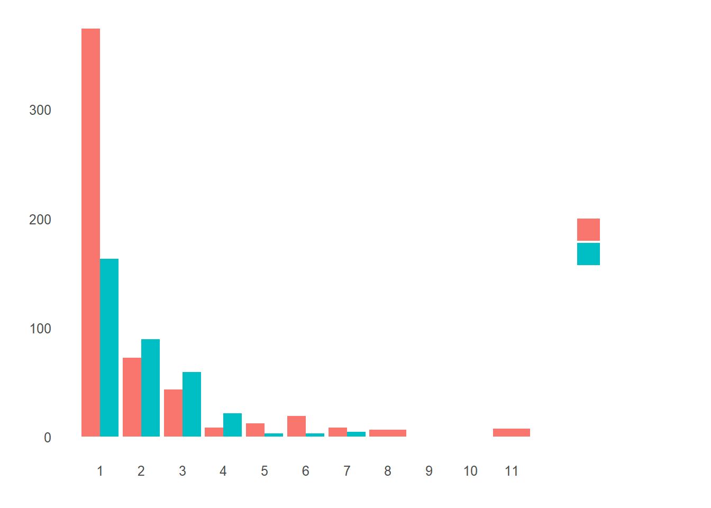

## Feature Engineering

### What’s in a name?

The first variable which catches my attention is passenger name because we can break it down into additional meaningful variables which can feed predictions or be used in the creation of additional new variables. For instance, passenger title is contained within the passenger name variable and we can use surname to represent families. Let’s do some feature engineering!


```r
# Grab title from passenger names
full$Title <- gsub('(.*, )|(\\..*)', '', full$Name)

# Show title counts by sex
table(full$Sex, full$Title)
```

```
##         
##          Capt Col Don Dona  Dr Jonkheer Lady Major Master Miss Mlle Mme
##   female    0   0   0    1   1        0    1     0      0  260    2   1
##   male      1   4   1    0   7        1    0     2     61    0    0   0
##         
##           Mr Mrs  Ms Rev Sir the Countess
##   female   0 197   2   0   0            1
##   male   757   0   0   8   1            0
```


```r
# Titles with very low cell counts to be combined to "rare" level
rare_title <- c('Dona', 'Lady', 'the Countess','Capt', 'Col', 'Don', 
                'Dr', 'Major', 'Rev', 'Sir', 'Jonkheer')

# Also reassign mlle, ms, and mme accordingly
full$Title[full$Title == 'Mlle']        <- 'Miss' 
full$Title[full$Title == 'Ms']          <- 'Miss'
full$Title[full$Title == 'Mme']         <- 'Mrs' 
full$Title[full$Title %in% rare_title]  <- 'Rare Title'

# Show title counts by sex again
table(full$Sex, full$Title)
```

```
##         
##          Master Miss  Mr Mrs Rare Title
##   female      0  264   0 198          4
##   male       61    0 757   0         25
```


```r
# Finally, grab surname from passenger name
full$Surname <- sapply(full$Name,  
                      function(x) strsplit(x, split = '[,.]')[[1]][1])
```

We have 875 unique surnames. I would be interested to infer ethnicity based on surname — another time.


### Do families sink or swim together?

Now that we’ve taken care of splitting passenger name into some new variables, we can take it a step further and make some new family variables. First we’re going to make a family size variable based on number of siblings/spouse(s) (maybe someone has more than one spouse?) and number of children/parents.


```r
# Create a family size variable including the passenger themselves
full$Fsize <- full$SibSp + full$Parch + 1

# Create a family variable 
full$Family <- paste(full$Surname, full$Fsize, sep='_')
```

What does our family size variable look like? To help us understand how it may relate to survival, let’s plot it among the training data.


```r
# Use ggplot2 to visualize the relationship between family size & survival
ggplot(full[1:891,], aes(x = Fsize, fill = factor(Survived))) +
  geom_bar(stat='count', position='dodge') +
  scale_x_continuous(breaks=c(1:11)) +
  labs(x = 'Family Size') +
  theme_few()
```




Ah hah. We can see that there’s a survival penalty to singletons and those with family sizes above 4. We can collapse this variable into three levels which will be helpful since there are comparatively fewer large families. Let’s create a discretized family size variable.


```r
# Discretize family size
full$FsizeD[full$Fsize == 1] <- 'singleton'
full$FsizeD[full$Fsize < 5 & full$Fsize > 1] <- 'small'
full$FsizeD[full$Fsize > 4] <- 'large'

# Show family size by survival using a mosaic plot
mosaicplot(table(full$FsizeD, full$Survived), main='Family Size by Survival', shade=TRUE)
```


The mosaic plot shows that we preserve our rule that there’s a survival penalty among singletons and large families, but a benefit for passengers in small families. I want to do something further with our age variable, but 263 rows have missing age values, so we will have to wait until after we address missingness.

### Treat a few more variables …

What’s left? There’s probably some potentially useful information in the passenger cabin variable including about their deck. Let’s take a look.


```r
# This variable appears to have a lot of missing values
full$Cabin[1:28]
```

```
##  [1] ""            "C85"         ""            "C123"        ""           
##  [6] ""            "E46"         ""            ""            ""           
## [11] "G6"          "C103"        ""            ""            ""           
## [16] ""            ""            ""            ""            ""           
## [21] ""            "D56"         ""            "A6"          ""           
## [26] ""            ""            "C23 C25 C27"
```


```r
# The first character is the deck. For example:
strsplit(full$Cabin[2], NULL)[[1]]
```

```
## [1] "C" "8" "5"
```


```r
# Create a Deck variable. Get passenger deck A - F:
full$Deck<-factor(sapply(full$Cabin, function(x) strsplit(x, NULL)[[1]][1]))
```

There’s more that likely could be done here including looking into cabins with multiple rooms listed (e.g., row 28: “C23 C25 C27”), but given the sparseness of the column we’ll stop here.


