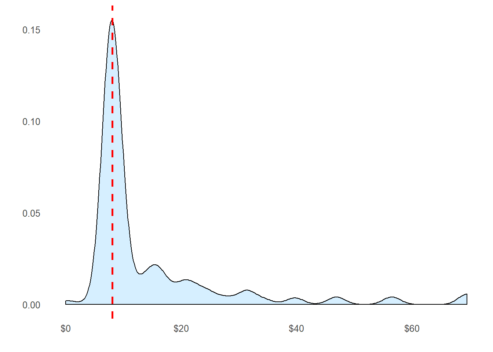

## Missingness

Now we’re ready to start exploring missing data and rectifying it through imputation. There are a number of different ways we could go about doing this. Given the small size of the dataset, we probably should not opt for deleting either entire observations (rows) or variables (columns) containing missing values. We’re left with the option of either replacing missing values with a sensible values given the distribution of the data, e.g., the mean, median or mode. Finally, we could go with prediction. We’ll use both of the two latter methods and I’ll rely on some data visualization to guide our decisions.

### Sensible value imputation


```r
# Passengers 62 and 830 are missing Embarkment
full[c(62, 830), 'Embarked']
```

```
## [1] "" ""
```


We will infer their values for **embarkment** based on present data that we can imagine may be relevant: **passenger class** and **fare**. We see that they paid 80,and NA, respectively and their classes are, 1, and NA. So from where did they embark?


```r
# Get rid of our missing passenger IDs
embark_fare <- full %>%
  filter(PassengerId != 62 & PassengerId != 830)

# Use ggplot2 to visualize embarkment, passenger class, & median fare
ggplot(embark_fare, aes(x = Embarked, y = Fare, fill = factor(Pclass))) +
  geom_boxplot() +
  geom_hline(aes(yintercept=80), 
    colour='red', linetype='dashed', lwd=2) +
  scale_y_continuous(labels=dollar_format()) +
  theme_few()
```


Voilà! The median fare for a first class passenger departing from Charbourg (‘C’) coincides nicely with the $80 paid by our embarkment-deficient passengers. I think we can safely replace the NA values with ‘C’.


```r
# Since their fare was $80 for 1st class, they most likely embarked from 'C'
full$Embarked[c(62, 830)] <- 'C'
```

We’re close to fixing the handful of NA values here and there. Passenger on row 1044 has an NA Fare value.


```r
# Show row 1044
full[1044, ]
```

```
##      PassengerId Survived Pclass               Name  Sex  Age SibSp Parch
## 1044        1044       NA      3 Storey, Mr. Thomas male 60.5     0     0
##      Ticket Fare Cabin Embarked Title Surname Fsize   Family    FsizeD
## 1044   3701   NA              S    Mr  Storey     1 Storey_1 singleton
##      Deck
## 1044 <NA>
```

This is a third class passenger who departed from Southampton (‘S’). Let’s visualize Fares among all others sharing their class and embarkment (n = 494).

```r
ggplot(full[full$Pclass == '3' & full$Embarked == 'S', ], 
  aes(x = Fare)) +
  geom_density(fill = '#99d6ff', alpha=0.4) + 
  geom_vline(aes(xintercept=median(Fare, na.rm=T)),
    colour='red', linetype='dashed', lwd=1) +
  scale_x_continuous(labels=dollar_format()) +
  theme_few()
```




From this visualization, it seems quite reasonable to replace the NA Fare value with median for their class and embarkment which is $8.05.


```r
# Replace missing fare value with median fare for class/embarkment
full$Fare[1044] <- median(full[full$Pclass == '3' & full$Embarked == 'S', ]$Fare, na.rm = TRUE)
```

### Predictive imputation

Finally, as we noted earlier, there are quite a few missing Age values in our data. We are going to get a bit more fancy in imputing missing age values. Why? Because we can. We will create a model predicting ages based on other variables.


```r
# Show number of missing Age values
sum(is.na(full$Age))
```

```
## [1] 263
```

We could definitely use rpart (recursive partitioning for regression) to predict missing ages, but I’m going to use the mice package for this task just for something different. You can read more about multiple imputation using chained equations in r [here](http://www.jstatsoft.org/article/view/v045i03/v45i03.pdf) (PDF). Since we haven’t done it yet, I’ll first factorize the factor variables and then perform mice imputation.


```r
# Make variables factors into factors
factor_vars <- c('PassengerId','Pclass','Sex','Embarked',
                 'Title','Surname','Family','FsizeD')

full[factor_vars] <- lapply(full[factor_vars], function(x) as.factor(x))

# Set a random seed
set.seed(129)

# Perform mice imputation, excluding certain less-than-useful variables:
mice_mod <- mice(full[, !names(full) %in% c('PassengerId','Name','Ticket','Cabin','Family','Surname','Survived')], method='rf') 
```

```
## 
##  iter imp variable
##   1   1  Age  Deck
##   1   2  Age  Deck
##   1   3  Age  Deck
##   1   4  Age  Deck
##   1   5  Age  Deck
##   2   1  Age  Deck
##   2   2  Age  Deck
##   2   3  Age  Deck
##   2   4  Age  Deck
##   2   5  Age  Deck
##   3   1  Age  Deck
##   3   2  Age  Deck
##   3   3  Age  Deck
##   3   4  Age  Deck
##   3   5  Age  Deck
##   4   1  Age  Deck
##   4   2  Age  Deck
##   4   3  Age  Deck
##   4   4  Age  Deck
##   4   5  Age  Deck
##   5   1  Age  Deck
##   5   2  Age  Deck
##   5   3  Age  Deck
##   5   4  Age  Deck
##   5   5  Age  Deck
```


```r
# Save the complete output 
mice_output <- complete(mice_mod)
```

Let’s compare the results we get with the original distribution of passenger ages to ensure that nothing has gone completely awry.


```r
# Plot age distributions
par(mfrow=c(1,2))
hist(full$Age, freq=F, main='Age: Original Data', 
  col='darkgreen', ylim=c(0,0.04))
hist(mice_output$Age, freq=F, main='Age: MICE Output', 
  col='lightgreen', ylim=c(0,0.04))
```


Things look good, so let’s replace our age vector in the original data with the output from the mice model.


```r
# Replace Age variable from the mice model.
full$Age <- mice_output$Age

# Show new number of missing Age values
sum(is.na(full$Age))
```

```
## [1] 0
```

We’ve finished imputing values for all variables that we care about for now! Now that we have a complete Age variable, there are just a few finishing touches I’d like to make. We can use Age to do just a bit more feature engineering …

### Feature Engineering: Round 2

Now that we know everyone’s age, we can create a couple of new age-dependent variables: Child and Mother. A child will simply be someone under 18 years of age and a mother is a passenger who is 
- female
- over 18
- has more than 0 children (no kidding!)
- does not have the title ‘Miss’.


```r
# First we'll look at the relationship between age & survival
ggplot(full[1:891,], aes(Age, fill = factor(Survived))) + 
  geom_histogram() + 
  # I include Sex since we know (a priori) it's a significant predictor
  facet_grid(.~Sex) + 
  theme_few()
```


```r
# Create the column child, and indicate whether child or adult
full$Child[full$Age < 18] <- 'Child'
full$Child[full$Age >= 18] <- 'Adult'

# Show counts
table(full$Child, full$Survived)
```

```
##        
##           0   1
##   Adult 484 274
##   Child  65  68
```

Looks like being a child doesn’t hurt, but it’s not going to necessarily save you either! We will finish off our feature engineering by creating the Mother variable. Maybe we can hope that mothers are more likely to have survived on the Titanic.


```r
# Adding Mother variable
full$Mother <- 'Not Mother'
full$Mother[full$Sex == 'female' & full$Parch > 0 & full$Age > 18 & full$Title != 'Miss'] <- 'Mother'

# Show counts
table(full$Mother, full$Survived)
```

```
##             
##                0   1
##   Mother      16  39
##   Not Mother 533 303
```


```r
# Finish by factorizing our two new factor variables
full$Child  <- factor(full$Child)
full$Mother <- factor(full$Mother)
```


All of the variables we care about should be taken care of and there should be no missing data. I’m going to double check just to be sure:


```r
md.pattern(full)
```

```
## Warning in data.matrix(x): NAs introduced by coercion

## Warning in data.matrix(x): NAs introduced by coercion

## Warning in data.matrix(x): NAs introduced by coercion
```

```
##     PassengerId Pclass Sex Age SibSp Parch Fare Embarked Title Surname
## 150           1      1   1   1     1     1    1        1     1       1
##  61           1      1   1   1     1     1    1        1     1       1
##  54           1      1   1   1     1     1    1        1     1       1
## 511           1      1   1   1     1     1    1        1     1       1
##  30           1      1   1   1     1     1    1        1     1       1
## 235           1      1   1   1     1     1    1        1     1       1
## 176           1      1   1   1     1     1    1        1     1       1
##  92           1      1   1   1     1     1    1        1     1       1
##               0      0   0   0     0     0    0        0     0       0
##     Fsize Family FsizeD Child Mother Ticket Survived Deck Name Cabin     
## 150     1      1      1     1      1      1        1    1    0     0    2
##  61     1      1      1     1      1      1        0    1    0     0    3
##  54     1      1      1     1      1      0        1    1    0     0    3
## 511     1      1      1     1      1      1        1    0    0     0    3
##  30     1      1      1     1      1      0        0    1    0     0    4
## 235     1      1      1     1      1      1        0    0    0     0    4
## 176     1      1      1     1      1      0        1    0    0     0    4
##  92     1      1      1     1      1      0        0    0    0     0    5
##         0      0      0     0      0    352      418 1014 1309  1309 4402
```

Wow! We have finally finished treating all of the relevant missing values in the Titanic dataset which has included some fancy imputation with mice. We have also successfully created several new variables which we hope will help us build a model which reliably predicts survival.


